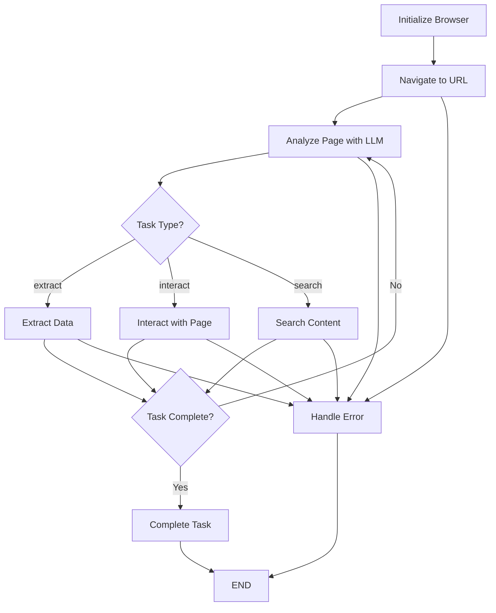

# 🦜 Playwright LangGraph Agent - Complete Pedagogical Guide & Usage Examples

A **comprehensive, production-grade tutorial and starter template** for building autonomous web-browsing AI agents using Playwright (browser automation), LangGraph (LLM state orchestration), and OpenAI (LLM reasoning). This guide provides both theoretical understanding and practical examples to master modern AI agent development.

---

## 📦 1. Architecture Overview

### **The Big Picture**
This project demonstrates how to build **intelligent web automation agents** that combine:
- 🤖 **LLM Reasoning** (OpenAI GPT-4) for decision-making
- 🌐 **Browser Automation** (Playwright) for web interactions  
- 🔄 **State Orchestration** (LangGraph) for workflow management
- 🐍 **Modern Python** with async/await patterns

### **Core Design Principles**
1. **Separation of Concerns**: Clean boundaries between browser, agent, and state logic
2. **Async-First**: Built for concurrent operations and scalability
3. **Error-Resilient**: Comprehensive error handling and retry mechanisms
4. **Observable**: Full logging and state tracking for debugging
5. **Extensible**: Easy to add new capabilities without refactoring

---

## 🏗️ 2. Directory Structure (Modular Architecture)

```plaintext
playwright_langgraph_agent/
├── 🎯 Core Entry Points
│   ├── main.py                   # CLI interface and demo runner
│   ├── config.py                 # Environment setup and configuration
│   └── state.py                  # Shared state definitions (BrowserState)
├── 🤖 Agent Logic (The Brain)
│   └── agent/
│       └── web_browsing_agent.py # LangGraph orchestration + LLM reasoning
├── 🌐 Browser Automation (The Hands)
│   └── browser/
│       └── playwright_manager.py # Playwright wrapper for web actions
├── 🛠️ Utilities & Tools
│   ├── toolkit/
│   │   └── web_toolkit.py        # Batch processing and export utilities
│   └── utils.py                  # Common helper functions
├── 📚 Examples & Demos
│   └── examples/
│       └── demo_tasks.py         # Working examples and tutorials
├── 🧪 Testing
│   └── tests/                    # Comprehensive test suite
│       ├── test_playwright.py         # Browser automation tests
│       ├── test_playwright_manager.py # Manager layer tests
│       └── test_web_browsing_agent.py # Full agent integration tests
└── 📖 Documentation
    └── docs/                     # Detailed guides for each component
```

---

## 🧠 3. Deep Dive: How the Agent Works

### **The Agent's Mind: LangGraph State Machine**

The agent operates as a **state machine** with clearly defined states and transitions:



### **State Transitions Explained**

1. **Initialize Browser**: Start headless Chrome with optimal settings
2. **Navigate**: Load target URL and capture initial page state
3. **Analyze Page**: Use LLM to understand page content and decide next action
4. **Execute Action**: Perform extraction, interaction, or search based on LLM decision
5. **Check Completion**: Determine if task is finished or needs more steps
6. **Complete/Error**: Cleanup and return results

### **The LLM's Role**
At each analysis step, the LLM receives:
- **Task description** (what the user wants)
- **Current page content** (HTML snippets, title, URL)
- **Available elements** (buttons, links, forms found by Playwright)
- **Navigation history** (what's been done so far)

The LLM responds with structured JSON indicating:
- Whether the task is complete
- What action to take next (extract/interact/search)
- Which elements to target
- Reasoning for the decision

---

## 🚀 4. Quickstart: From Zero to Running Agent

### **Step 1: Environment Setup**
```bash
# Clone and setup virtual environment
git clone <your-repo>
cd playwright_langgraph_agent
python -m venv .venv

# Activate virtual environment
source .venv/bin/activate  # On Windows: .venv\Scripts\activate

# Install dependencies
pip install -r requirements.txt

# Install browser drivers
playwright install chromium
```

### **Step 2: Configure API Keys**
```bash
# Option 1: Environment variable
export OPENAI_API_KEY="sk-your-key-here"

# Option 2: Create .env file
echo "OPENAI_API_KEY=sk-your-key-here" > .env
```

### **Step 3: Run Your First Agent**
```python
# quick_start.py
import os
import asyncio
from agent.web_browsing_agent import WebBrowsingAgent

async def main():
    # Initialize agent
    api_key = os.getenv("OPENAI_API_KEY")
    agent = WebBrowsingAgent(api_key, headless=True)
    
    # Run a simple extraction task
    result = await agent.execute_task(
        url="https://example.com",
        task="Extract the main heading and any links on the page",
        task_type="extract"
    )
    
    # Display results
    print("🎯 Task Success:", result["success"])
    print("📄 Page Title:", result.get("final_url"))
    print("📊 Extracted Elements:", len(result.get("extracted_data", {}).get("elements", [])))
    
    if result["success"]:
        print("✅ Task completed successfully!")
    else:
        print("❌ Task failed:", result.get("error"))

if __name__ == "__main__":
    asyncio.run(main())
```

### **Step 4: Test Everything Works**
```bash
# Run the quick start
python quick_start.py

# Run comprehensive tests
pytest tests/ -v
```

---

## 💡 5. Practical Usage Examples

### **Example 1: News Headlines Extraction**
```python
import asyncio
from agent.web_browsing_agent import WebBrowsingAgent
from utils import save_json, timestamp_str

async def extract_news_headlines():
    """Extract top headlines from multiple news sites"""
    agent = WebBrowsingAgent(os.getenv("OPENAI_API_KEY"), headless=True)
    
    news_sites = [
        ("https://news.ycombinator.com", "Extract top 5 tech news headlines and their links"),
        ("https://www.bbc.com/news", "Extract main news headlines from the homepage"),
        ("https://techcrunch.com", "Find the latest startup and technology news headlines")
    ]
    
    all_results = []
    
    for url, task in news_sites:
        print(f"🔄 Processing: {url}")
        
        result = await agent.execute_task(
            url=url,
            task=task,
            task_type="extract"
        )
        
        result["site_name"] = url.split("//")[1].split("/")[0]
        all_results.append(result)
        
        # Brief pause between requests
        await asyncio.sleep(2)
    
    # Save consolidated results
    save_json(all_results, f"news_headlines_{timestamp_str()}.json")
    
    # Print summary
    successful = sum(1 for r in all_results if r["success"])
    print(f"✅ Successfully processed {successful}/{len(all_results)} sites")
    
    return all_results

# Run the example
asyncio.run(extract_news_headlines())
```

### **Example 2: E-commerce Product Research**
```python
async def research_products():
    """Research products across multiple e-commerce sites"""
    agent = WebBrowsingAgent(os.getenv("OPENAI_API_KEY"), headless=True)
    
    search_queries = [
        ("https://www.amazon.com", "Search for 'wireless headphones' and extract top 3 product names and prices"),
        ("https://www.bestbuy.com", "Find laptop deals and extract product names, prices, and ratings"),
    ]
    
    product_data = []
    
    for url, task in search_queries:
        result = await agent.execute_task(
            url=url,
            task=task,
            task_type="search"  # Use search task type
        )
        
        if result["success"]:
            product_data.append({
                "site": url,
                "search_results": result["extracted_data"],
                "timestamp": result["timestamp"]
            })
    
    return product_data
```

### **Example 3: Form Automation**
```python
async def automate_contact_form():
    """Demonstrate form filling capabilities"""
    agent = WebBrowsingAgent(os.getenv("OPENAI_API_KEY"), headless=True)
    
    # Form data to fill
    form_data = {
        "#name": "John Smith",
        "#email": "john.smith@example.com", 
        "#message": "This is an automated test message",
        "#subject": "Test Inquiry"
    }
    
    result = await agent.execute_task(
        url="https://httpbin.org/forms/post",  # Test form
        task="Fill out the contact form with the provided information",
        task_type="interact",
        form_data=form_data
    )
    
    return result
```

### **Example 4: Competitive Analysis**
```python
async def competitive_analysis():
    """Analyze competitor websites for features and content"""
    agent = WebBrowsingAgent(os.getenv("OPENAI_API_KEY"), headless=True)
    
    competitors = [
        "https://competitor1.com",
        "https://competitor2.com", 
        "https://competitor3.com"
    ]
    
    analysis_results = []
    
    for competitor_url in competitors:
        result = await agent.execute_task(
            url=competitor_url,
            task="Analyze the homepage: extract key features, pricing information, and unique selling propositions",
            task_type="extract"
        )
        
        # Add competitive intelligence
        if result["success"]:
            analysis_results.append({
                "competitor": competitor_url,
                "analysis_date": result["timestamp"],
                "features_found": result["extracted_data"],
                "page_title": result.get("final_url", ""),
                "screenshot": result.get("screenshot", "")
            })
    
    # Generate comparison report
    save_json(analysis_results, f"competitive_analysis_{timestamp_str()}.json")
    
    return analysis_results
```

---

## 🛠️ 6. Advanced Configuration & Customization

### **Agent Configuration Options**
```python
class WebBrowsingAgent:
    def __init__(
        self, 
        openai_api_key: str, 
        headless: bool = True,
        viewport_width: int = 1280,
        viewport_height: int = 720,
        max_steps: int = 20,
        model: str = "gpt-4"
    ):
        # Custom configuration
        self.llm = ChatOpenAI(
            model=model,  # Could be "gpt-3.5-turbo", "gpt-4", etc.
            api_key=openai_api_key,
            temperature=0.1,  # Low temperature for consistent decisions
            max_tokens=1500
        )
        
        self.browser = PlaywrightManager(
            headless=headless,
            viewport_width=viewport_width,
            viewport_height=viewport_height
        )
        
        self.max_steps = max_steps  # Prevent infinite loops
```

### **Custom Task Types**
```python
# Extend the agent with custom task types
async def _analyze_page(self, state: BrowserState) -> BrowserState:
    # Add custom task type handling
    if state.task_type == "monitor":
        return await self._monitor_changes(state)
    elif state.task_type == "validate":
        return await self._validate_content(state)
    # ... existing logic
```

### **Browser Customization**
```python
# Custom browser settings in playwright_manager.py
async def start(self):
    self.browser = await self.playwright.chromium.launch(
        headless=self.headless,
        args=[
            '--no-sandbox',
            '--disable-dev-shm-usage',
            '--disable-blink-features=AutomationControlled',
            '--user-agent=Custom User Agent String',  # Custom UA
            '--proxy-server=proxy:8080',  # Proxy support
            '--disable-images',  # Faster loading
        ]
    )
```

---

## 🔍 7. Debugging & Troubleshooting

### **Enable Debug Logging**
```python
import logging
from config import setup_logging

# Enable detailed logging
setup_logging("DEBUG", "agent_debug.log")

# Run agent with verbose output
agent = WebBrowsingAgent(api_key, headless=False)  # Visual mode
result = await agent.execute_task(url, task, task_type)
```

### **Common Issues & Solutions**

#### **🚨 Issue: Agent gets stuck in loops**
```python
# Solution: Check step counting and completion logic
if not hasattr(state, 'step_count'):
    state.step_count = 0
state.step_count += 1

if state.step_count >= self.max_steps:
    state.task_completed = True
    return "complete_task"
```

#### **🚨 Issue: LLM returns invalid JSON**
```python
# Solution: Add fallback parsing
try:
    decision = json.loads(response.content)
except json.JSONDecodeError:
    # Fallback to heuristic parsing
    content = response.content.lower()
    if "complete" in content:
        state.task_completed = True
    state.task_type = "extract"  # Safe default
```

#### **🚨 Issue: Browser crashes or timeouts**
```python
# Solution: Robust error handling
try:
    result = await self.browser.navigate(url)
except Exception as e:
    logger.error(f"Navigation failed: {e}")
    state.error_message = f"Navigation failed: {str(e)}"
    state.retry_count += 1
```

### **Performance Monitoring**
```python
import time
from utils import save_json

async def monitor_agent_performance():
    start_time = time.time()
    
    result = await agent.execute_task(url, task, task_type)
    
    performance_metrics = {
        "execution_time": time.time() - start_time,
        "steps_taken": len(result.get("navigation_history", [])),
        "success_rate": result["success"],
        "error_occurred": bool(result.get("error")),
        "timestamp": timestamp_str()
    }
    
    save_json(performance_metrics, "performance_log.json")
    return performance_metrics
```

---

## 🧪 8. Testing Strategy & Best Practices

### **Test Pyramid Approach**
```python
# 1. Unit Tests - Test individual components
def test_browser_manager():
    """Test browser automation in isolation"""
    pass

# 2. Integration Tests - Test component interactions  
def test_agent_browser_integration():
    """Test agent + browser working together"""
    pass

# 3. End-to-End Tests - Test complete workflows
def test_full_extraction_workflow():
    """Test complete user scenario"""
    pass
```

### **Mocking for Fast Tests**
```python
import pytest
from unittest.mock import AsyncMock, patch

@pytest.fixture
def mock_browser():
    mock = AsyncMock()
    mock.navigate.return_value = {"success": True, "url": "test.com"}
    mock.extract_elements.return_value = [{"tag": "h1", "text": "Test"}]
    return mock

@pytest.mark.asyncio
async def test_agent_with_mock_browser(mock_browser):
    with patch('agent.web_browsing_agent.PlaywrightManager', return_value=mock_browser):
        agent = WebBrowsingAgent("test-key")
        result = await agent.execute_task("test.com", "extract", "extract")
        assert result["success"]
```

### **Continuous Integration Tests**
```yaml
# .github/workflows/test.yml
name: Agent Tests
on: [push, pull_request]
jobs:
  test:
    runs-on: ubuntu-latest
    steps:
      - uses: actions/checkout@v2
      - name: Setup Python
        uses: actions/setup-python@v2
        with:
          python-version: '3.9'
      - name: Install dependencies
        run: |
          pip install -r requirements.txt
          playwright install chromium
      - name: Run tests
        env:
          OPENAI_API_KEY: ${{ secrets.OPENAI_API_KEY }}
        run: pytest tests/ -v
```

---

## 🚀 9. Production Deployment Considerations

### **Scaling Considerations**
```python
# Batch processing with concurrency control
from toolkit.web_toolkit import run_batch

async def production_batch_processing():
    agent = WebBrowsingAgent(api_key, headless=True)
    
    # Process many URLs with controlled concurrency
    url_tasks = [
        {"url": f"https://example{i}.com", "task": "extract content"}
        for i in range(100)
    ]
    
    # Limit concurrent browsers to prevent resource exhaustion
    results = await run_batch(agent, url_tasks, max_concurrent=5)
    return results
```

### **Error Recovery & Resilience**
```python
import asyncio
from tenacity import retry, stop_after_attempt, wait_exponential

class ProductionAgent(WebBrowsingAgent):
    @retry(
        stop=stop_after_attempt(3),
        wait=wait_exponential(multiplier=1, min=4, max=10)
    )
    async def execute_task_with_retry(self, url, task, task_type):
        """Execute task with automatic retry on failure"""
        try:
            return await self.execute_task(url, task, task_type)
        except Exception as e:
            logger.error(f"Task failed, will retry: {e}")
            raise
```

### **Resource Management**
```python
import contextlib

@contextlib.asynccontextmanager
async def managed_agent(api_key):
    """Context manager for proper resource cleanup"""
    agent = WebBrowsingAgent(api_key, headless=True)
    try:
        yield agent
    finally:
        await agent.browser.cleanup()
        
# Usage
async with managed_agent(api_key) as agent:
    result = await agent.execute_task(url, task, task_type)
```

### **Monitoring & Alerting**
```python
import structlog
from datetime import datetime

logger = structlog.get_logger()

async def monitored_execution(agent, url, task, task_type):
    """Execute task with comprehensive monitoring"""
    start_time = datetime.now()
    
    try:
        result = await agent.execute_task(url, task, task_type)
        
        # Log success metrics
        logger.info(
            "task_completed",
            url=url,
            task_type=task_type,
            success=result["success"],
            duration=(datetime.now() - start_time).total_seconds(),
            elements_extracted=len(result.get("extracted_data", {}).get("elements", []))
        )
        
        return result
        
    except Exception as e:
        # Log error metrics
        logger.error(
            "task_failed",
            url=url,
            task_type=task_type,
            error=str(e),
            duration=(datetime.now() - start_time).total_seconds()
        )
        raise
```

---

## 🔮 10. Future Extensions & Advanced Features

### **Multi-Model Support**
```python
# Support for different LLM providers
class MultiModelAgent(WebBrowsingAgent):
    def __init__(self, provider="openai", **kwargs):
        if provider == "anthropic":
            from langchain_anthropic import ChatAnthropic
            self.llm = ChatAnthropic(model="claude-3-sonnet-20240229")
        elif provider == "google":
            from langchain_google_genai import ChatGoogleGenerativeAI
            self.llm = ChatGoogleGenerativeAI(model="gemini-pro")
        else:
            super().__init__(**kwargs)
```

### **Computer Vision Integration**
```python
# Add OCR and image analysis capabilities
async def analyze_visual_content(self, state: BrowserState):
    """Analyze images and visual content on the page"""
    screenshot_path = state.screenshot_path
    
    # OCR for text in images
    import pytesseract
    from PIL import Image
    
    if screenshot_path:
        image = Image.open(screenshot_path)
        extracted_text = pytesseract.image_to_string(image)
        state.extracted_data["ocr_text"] = extracted_text
    
    return state
```

### **Authentication & Session Management**
```python
# Add login and session handling
async def handle_authentication(self, credentials):
    """Handle login flows and maintain sessions"""
    login_result = await self.browser.fill_form({
        "#username": credentials["username"],
        "#password": credentials["password"]
    })
    
    await self.browser.click_element("#login-button")
    await self.browser.page.wait_for_selector(".dashboard", timeout=10000)
    
    return login_result
```

### **Data Pipeline Integration**
```python
# Connect to data processing pipelines
class DataPipelineAgent(WebBrowsingAgent):
    def __init__(self, pipeline_config, **kwargs):
        super().__init__(**kwargs)
        self.pipeline = self._setup_pipeline(pipeline_config)
    
    async def execute_with_pipeline(self, url, task, task_type):
        result = await self.execute_task(url, task, task_type)
        
        # Send to data pipeline
        if result["success"]:
            await self.pipeline.process(result["extracted_data"])
        
        return result
```

---

## 📚 11. Learning Resources & Next Steps

### **Essential Concepts to Master**
1. **Async Python**: Understanding coroutines, event loops, and concurrent execution
2. **LangGraph**: State machines, conditional routing, and LLM orchestration
3. **Playwright**: Browser automation, element selection, and page interactions
4. **LLM Prompting**: Structured prompts, JSON parsing, and decision-making

### **Recommended Learning Path**
1. **Start Simple**: Run the basic examples to understand the flow
2. **Customize**: Modify tasks and target different websites
3. **Extend**: Add new task types and browser capabilities
4. **Scale**: Implement batch processing and error handling
5. **Deploy**: Move to production with monitoring and resilience

### **Community & Resources**
- [Playwright Documentation](https://playwright.dev/python/)
- [LangGraph Tutorials](https://langchain-ai.github.io/langgraph/)
- [OpenAI API Guide](https://platform.openai.com/docs)
- [Async Python Tutorial](https://docs.python.org/3/library/asyncio.html)

---

## 🎯 12. Summary & Key Takeaways

This Playwright LangGraph Agent represents a **modern approach to web automation** that combines:

✅ **Intelligent Decision Making**: LLMs provide reasoning and adaptability  
✅ **Robust Architecture**: Clean separation of concerns and error handling  
✅ **Production Ready**: Comprehensive testing and monitoring capabilities  
✅ **Highly Extensible**: Easy to customize and add new features  
✅ **Educational Value**: Excellent learning resource for modern Python development  

### **When to Use This Agent**
- **Web Scraping**: Dynamic content extraction from complex sites
- **Automated Testing**: User journey testing with intelligent decisions
- **Data Collection**: Research and competitive analysis at scale
- **Form Automation**: Repetitive data entry and submission tasks
- **Monitoring**: Website change detection and alerting

### **Key Success Factors**
1. **Clear Task Definition**: Specific, actionable instructions work best
2. **Robust Error Handling**: Plan for failures and edge cases
3. **Proper Testing**: Test each component thoroughly before integration
4. **Resource Management**: Monitor browser usage and cleanup properly
5. **Iterative Development**: Start simple and add complexity gradually

**Happy automating!** 🚀🤖

---

*This guide represents a comprehensive foundation for building intelligent web automation agents. Use it as a starting point for your own projects and extend it based on your specific needs.*